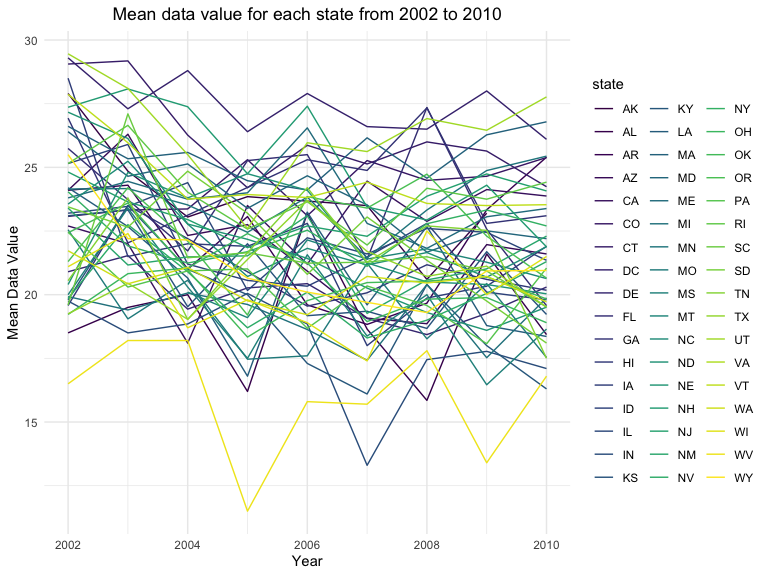
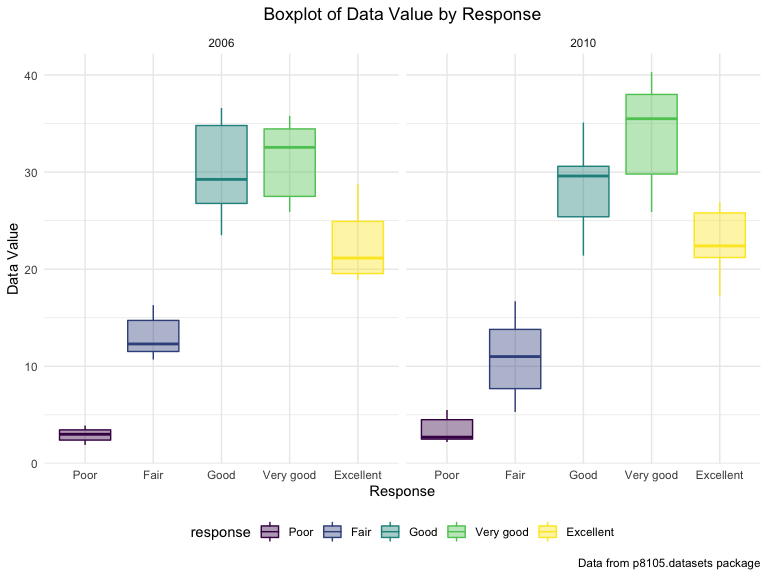
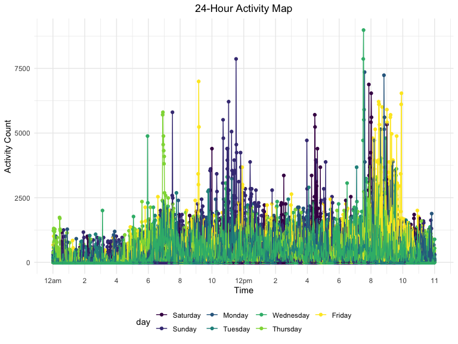

p8105\_hw3\_rs4025
================
Rebecca Silva
10/14/2019

## Problem 1

``` r
data("instacart")
```

The `instacart` dataset gives information about online grocery shopping
in 2017 using the grocery service, Instacart. It has 1384617
observations where each observation represents a specific product from a
specific order number. There are 15 variables, 4 of which are character
variables, and 11 of which are integer variables. Some key variables and
ones that we focus on are as follows:

  - `order_id`: order number
  - `product_id`: product number
  - `user_id`: user number
  - `order_number`: sequence number of order for user
  - `order_dow`: day of the week on which order placed (0-6). *Note*: we
    will assume 0 is Saturday and 6 is Friday.
  - `order_hour_of_day`: hour of day in which order placed
  - `product_name` (character): name of product
  - `aisle_id`: aisle number
  - `aisle` (character): sorts/types of products aisle contains
  - `department` (character): name of department/ product categories

To give an example of the dataset, the first 3 observations are shown
below in Table 1.

``` r
# table of head of ds
head(instacart, 3)  %>% 
  knitr::kable(caption = "Table 1: First 3 Observations of Instacart dataset")
```

<table>

<caption>

Table 1: First 3 Observations of Instacart dataset

</caption>

<thead>

<tr>

<th style="text-align:right;">

order\_id

</th>

<th style="text-align:right;">

product\_id

</th>

<th style="text-align:right;">

add\_to\_cart\_order

</th>

<th style="text-align:right;">

reordered

</th>

<th style="text-align:right;">

user\_id

</th>

<th style="text-align:left;">

eval\_set

</th>

<th style="text-align:right;">

order\_number

</th>

<th style="text-align:right;">

order\_dow

</th>

<th style="text-align:right;">

order\_hour\_of\_day

</th>

<th style="text-align:right;">

days\_since\_prior\_order

</th>

<th style="text-align:left;">

product\_name

</th>

<th style="text-align:right;">

aisle\_id

</th>

<th style="text-align:right;">

department\_id

</th>

<th style="text-align:left;">

aisle

</th>

<th style="text-align:left;">

department

</th>

</tr>

</thead>

<tbody>

<tr>

<td style="text-align:right;">

1

</td>

<td style="text-align:right;">

49302

</td>

<td style="text-align:right;">

1

</td>

<td style="text-align:right;">

1

</td>

<td style="text-align:right;">

112108

</td>

<td style="text-align:left;">

train

</td>

<td style="text-align:right;">

4

</td>

<td style="text-align:right;">

4

</td>

<td style="text-align:right;">

10

</td>

<td style="text-align:right;">

9

</td>

<td style="text-align:left;">

Bulgarian Yogurt

</td>

<td style="text-align:right;">

120

</td>

<td style="text-align:right;">

16

</td>

<td style="text-align:left;">

yogurt

</td>

<td style="text-align:left;">

dairy eggs

</td>

</tr>

<tr>

<td style="text-align:right;">

1

</td>

<td style="text-align:right;">

11109

</td>

<td style="text-align:right;">

2

</td>

<td style="text-align:right;">

1

</td>

<td style="text-align:right;">

112108

</td>

<td style="text-align:left;">

train

</td>

<td style="text-align:right;">

4

</td>

<td style="text-align:right;">

4

</td>

<td style="text-align:right;">

10

</td>

<td style="text-align:right;">

9

</td>

<td style="text-align:left;">

Organic 4% Milk Fat Whole Milk Cottage Cheese

</td>

<td style="text-align:right;">

108

</td>

<td style="text-align:right;">

16

</td>

<td style="text-align:left;">

other creams cheeses

</td>

<td style="text-align:left;">

dairy eggs

</td>

</tr>

<tr>

<td style="text-align:right;">

1

</td>

<td style="text-align:right;">

10246

</td>

<td style="text-align:right;">

3

</td>

<td style="text-align:right;">

0

</td>

<td style="text-align:right;">

112108

</td>

<td style="text-align:left;">

train

</td>

<td style="text-align:right;">

4

</td>

<td style="text-align:right;">

4

</td>

<td style="text-align:right;">

10

</td>

<td style="text-align:right;">

9

</td>

<td style="text-align:left;">

Organic Celery Hearts

</td>

<td style="text-align:right;">

83

</td>

<td style="text-align:right;">

4

</td>

<td style="text-align:left;">

fresh vegetables

</td>

<td style="text-align:left;">

produce

</td>

</tr>

</tbody>

</table>

For a more illustrative example, let Bob be a costumer on Instacart.
Bob’s order of the `product` Bulgarian yogurt from the `aisle` yogurt
and `department` dairy eggs, ordered on the 4th day of the week at hour
10 (12pm), represents one observation in the data set. Other variables
not listed in this example are included in the dataset, although we do
not focus on them in our exploration.

``` r
# number of aisles and orders
aisle = 
  instacart %>% 
  group_by(aisle) %>%   
  summarize(n = n()) %>% 
  arrange(desc(n))
```

There are 134 aisles in the online grocery store, the most popular of
which are fresh vegetables (150609 total orders), fresh fruits (150473
total orders), and packaged vegetables and fruit (78493 total orders).

``` r
# plot number of orders by aisles
instacart %>% 
  group_by(department, aisle) %>% 
  summarize(n = n()) %>% 
  ungroup() %>% 
  mutate(aisle = forcats::fct_reorder(aisle, n)) %>% 
  filter( n > 10000) %>% 
  ggplot(aes(x = aisle, y = n, fill = department)) + 
  geom_bar(stat = "identity") + 
  labs(
    title = "Number of Items Ordered in the Most Popular Aisles",
    x = "Aisle",
    y = "Number of Items", 
    caption = "Data from p8105.datasets package") +
  theme(legend.position = "right", 
        plot.title = element_text(hjust = 0.5)) + 
  coord_flip()
```


The plot demonstrates that following vegetables and fruits (all in the
department, produce), dairy is the most popular product type. This makes
sense because produce and dairy products go bad more frequently and they
are are a staple in a many kitchens, so the number of items ordered is
the largest. Although color does not help us identify every single
aisle’s department well, it helps us distinguish the top two
departments (produce and dairy), which is interesting to see.

``` r
table_aisle = 
  instacart %>% 
  filter(aisle %in% c("baking ingredients",
                      "dog food care", 
                      "packaged vegetables fruits")) %>% 
  group_by(aisle, product_name) %>% 
  summarise(n = n()) %>% 
  mutate(rank = min_rank(desc(n))) %>% 
  filter(rank < 4) %>% 
  arrange(desc(n)) %>% 
  select(-rank)
        
knitr::kable(table_aisle, 
            caption = "Table 2: Most popular items from Baking Ingredients,
            Dog Food Care, <br>
            and Packaged Vegetables and Fruit", 
            col.names = c("Aisle",
                           "Product",
                           "Number of Orders"))
```

<table>

<caption>

Table 2: Most popular items from Baking Ingredients, Dog Food Care, <br>
and Packaged Vegetables and Fruit

</caption>

<thead>

<tr>

<th style="text-align:left;">

Aisle

</th>

<th style="text-align:left;">

Product

</th>

<th style="text-align:right;">

Number of Orders

</th>

</tr>

</thead>

<tbody>

<tr>

<td style="text-align:left;">

packaged vegetables fruits

</td>

<td style="text-align:left;">

Organic Baby Spinach

</td>

<td style="text-align:right;">

9784

</td>

</tr>

<tr>

<td style="text-align:left;">

packaged vegetables fruits

</td>

<td style="text-align:left;">

Organic Raspberries

</td>

<td style="text-align:right;">

5546

</td>

</tr>

<tr>

<td style="text-align:left;">

packaged vegetables fruits

</td>

<td style="text-align:left;">

Organic Blueberries

</td>

<td style="text-align:right;">

4966

</td>

</tr>

<tr>

<td style="text-align:left;">

baking ingredients

</td>

<td style="text-align:left;">

Light Brown Sugar

</td>

<td style="text-align:right;">

499

</td>

</tr>

<tr>

<td style="text-align:left;">

baking ingredients

</td>

<td style="text-align:left;">

Pure Baking Soda

</td>

<td style="text-align:right;">

387

</td>

</tr>

<tr>

<td style="text-align:left;">

baking ingredients

</td>

<td style="text-align:left;">

Cane Sugar

</td>

<td style="text-align:right;">

336

</td>

</tr>

<tr>

<td style="text-align:left;">

dog food care

</td>

<td style="text-align:left;">

Snack Sticks Chicken & Rice Recipe Dog Treats

</td>

<td style="text-align:right;">

30

</td>

</tr>

<tr>

<td style="text-align:left;">

dog food care

</td>

<td style="text-align:left;">

Organix Chicken & Brown Rice Recipe

</td>

<td style="text-align:right;">

28

</td>

</tr>

<tr>

<td style="text-align:left;">

dog food care

</td>

<td style="text-align:left;">

Small Dog Biscuits

</td>

<td style="text-align:right;">

26

</td>

</tr>

</tbody>

</table>

Table 2 shows us the most popular products in 3 specific aisles. It is
interesting to see that “Organic Baby Spinach” is by far the most
popular packaged produce, having almost twice as many orders as the
second and third most popular items in that aisle which are “Organic
Raspberries” and “Organic Blueberries”, respectively.

``` r
mean_table = 
  instacart %>% 
  filter( product_name %in% c("Pink Lady Apples", "Coffee Ice Cream")) %>% 
  select( product_name, order_dow, order_hour_of_day) %>% 
  group_by( product_name, order_dow) %>% 
  summarize(mean = round(mean(order_hour_of_day))) %>% 
  pivot_wider(
    names_from = order_dow, 
    values_from = mean)

knitr::kable(mean_table, 
            caption = "Table 3: Mean Hour of Day (Military time) for Orders of Pink Lady Apples <br> and Coffee Ice Cream", 
            col.names = c("Produce",
                           "Saturday",
                           "Sunday", "Monday", "Tuesday", "Wednesday", "Thursday", "Friday"))
```

<table>

<caption>

Table 3: Mean Hour of Day (Military time) for Orders of Pink Lady Apples
<br> and Coffee Ice Cream

</caption>

<thead>

<tr>

<th style="text-align:left;">

Produce

</th>

<th style="text-align:right;">

Saturday

</th>

<th style="text-align:right;">

Sunday

</th>

<th style="text-align:right;">

Monday

</th>

<th style="text-align:right;">

Tuesday

</th>

<th style="text-align:right;">

Wednesday

</th>

<th style="text-align:right;">

Thursday

</th>

<th style="text-align:right;">

Friday

</th>

</tr>

</thead>

<tbody>

<tr>

<td style="text-align:left;">

Coffee Ice Cream

</td>

<td style="text-align:right;">

14

</td>

<td style="text-align:right;">

14

</td>

<td style="text-align:right;">

15

</td>

<td style="text-align:right;">

15

</td>

<td style="text-align:right;">

15

</td>

<td style="text-align:right;">

12

</td>

<td style="text-align:right;">

14

</td>

</tr>

<tr>

<td style="text-align:left;">

Pink Lady Apples

</td>

<td style="text-align:right;">

13

</td>

<td style="text-align:right;">

11

</td>

<td style="text-align:right;">

12

</td>

<td style="text-align:right;">

14

</td>

<td style="text-align:right;">

12

</td>

<td style="text-align:right;">

13

</td>

<td style="text-align:right;">

12

</td>

</tr>

</tbody>

</table>

Note: In Table 3, I rounded mean hour to closest hour and assumed the
week started on a Saturday (day 0 = Saturday). Additionally, I left the
mean hour of day in military time so it would be easier to compare the
groups. Ultimately, the table shows that Pink Lady Apples are on average
ordered earlier than Coffee Ice Cream but not by that many hours. I
would have expected the mean hour of day to order ice cream to be later
in the day, around night time, but instead it is around early afternoon.

## Problem 2

``` r
# data cleaning
data("brfss_smart2010")
brfss = 
  janitor::clean_names(brfss_smart2010) %>% 
  separate(locationdesc, 
           into = c("state", "county"), 
           sep = " - ") %>% 
  select(- locationabbr) %>% 
  filter( topic == "Overall Health",
          response %in% c("Poor", "Fair","Good", "Very good", "Excellent")) %>% 
   mutate(response = forcats::fct_relevel(response, c("Poor", "Fair","Good", "Very good", "Excellent")))
```

``` r
# states at 7 or more locations

# 2002
brfss_2002 = 
  brfss %>% 
  filter( year == 2002) %>% 
  group_by(state) %>% 
  summarize( n_locations = n_distinct(county)) %>%  
  filter(n_locations >= 7)

# 2010
brfss_2010 = 
  brfss %>% 
  filter( year == 2010) %>% 
  group_by(state) %>% 
  summarize( n_locations = n_distinct(county)) %>%  
  filter(n_locations >= 7)
```

In 2002, the states CT, FL, MA, NC, NJ, PA were observed at 7 or more
location and in 2010, 14 states were observed at 7 or more locations,
specifically, CA, CO, FL, MA, MD, NC, NE, NJ, NY, OH, PA, SC, TX, WA.

``` r
# data set for excellent responses
brfss_excellent = 
  brfss %>% 
  filter( response == "Excellent") %>% 
  group_by(year, state) %>% 
  summarize(avg_data_value = mean(data_value,  na.rm = TRUE)) 

# spaghetti plot
brfss_excellent %>% 
  ggplot(aes( x = year, y = avg_data_value, color = state)) + 
  geom_line(aes(group = state)) + 
  theme(legend.position = "right") +
  labs(
    title = "Mean data value for each state from 2002 to 2010",
    x = "Year",
    y = "Mean Data Value") +
  theme(plot.title = element_text(hjust = 0.5))
```



The “spaghetti” plot of average value over time within a state shows how
varied the mean data value each year can be for the majority of states.
Although adding color is not helpful in identifying which states belongs
to each line, it helps show how the lines are frequently crossing each
other, further depicting the up and down nature of average values for
each state. This makes sense because I would assume response values are
generally independent of state.

``` r
# facet by year, boxplot plot
brfss %>% 
  filter( year %in% c(2006, 2010), state == "NY") %>% 
  ggplot(aes(x = response, y = data_value, color = response)) +
  geom_boxplot(aes(fill = response), alpha = .4) +
  facet_grid(~year) +
  labs(
      title = "Boxplot of Data Value by Response",
      x = "Response",
      y = "Data Value", 
      caption = "Data from p8105.datasets package") + 
  theme(plot.title = element_text(hjust = 0.5)) 
```



By looking at the distribution of responses from 2006 and 2010 next to
one another, we can see that for each response type, data values share
similar ranges of values but have differently shaped distributions and
peak around the different values within their respective similar range.
For example, for the “excellent” response type, in 2006 the distribution
of data values is right skewed while in 2010 it is left skewed, and the
median value for excellent is higher in 2010 than 2006. It is
interesting to see that “poor” responses show the least variability in
data values and “good” and “very good” responses seem to vary the most.

## Problem 3

``` r
# tidy data
accel = 
  read_csv("./data/accel_data.csv") %>% 
  janitor::clean_names() %>% 
  pivot_longer(
    activity_1:activity_1440,
    names_to = "minute_num", 
    values_to = "activity_count", 
    names_prefix = "activity_") %>% 
  mutate( minute_num = as.numeric(minute_num),
          day_type = replace( day , 
                             day %in% c("Saturday", "Sunday"),
                             "weekend"), 
         day_type = replace( day_type , 
                             day %in% c("Monday", "Tuesday", "Wednesday", "Thursday", "Friday"),
                             "weekday"),
         day = forcats::fct_relevel(day, c("Saturday", "Sunday","Monday", "Tuesday", "Wednesday", "Thursday", "Friday"))) %>% 
  select( week, day_id, day, day_type, everything())
```

The data set `accel` reports accelerometer data of a 63 year-old man for
5 weeks. There are 50400 observations, each representing a minute in the
5 weeks, and 6 variables. Variable descriptions are as follows:

  - `week`: numeric, representing week number (1-5)
  - `day_id`: numeric, number of day (1-35) with no significant meaning
    to ordering
  - `day`: factor, weekday (Saturday- level 1, to Friday- level 7)
  - `day_type`: character, values: weekend or weekday
  - `minute_num`: numeric, minute number (1-1440)
  - `activity_count`: numeric, data reported on activity

<!-- end list -->

``` r
# by day activity
table_total_activity = 
  accel %>% 
  group_by(week, day) %>% 
  summarize( total_activity = sum(activity_count)) %>% 
  pivot_wider(
    names_from = day, 
    values_from = total_activity
  )

knitr::kable(table_total_activity, 
             caption = "Total Activity per Day (in minutes)")
```

<table>

<caption>

Total Activity per Day (in minutes)

</caption>

<thead>

<tr>

<th style="text-align:right;">

week

</th>

<th style="text-align:right;">

Saturday

</th>

<th style="text-align:right;">

Sunday

</th>

<th style="text-align:right;">

Monday

</th>

<th style="text-align:right;">

Tuesday

</th>

<th style="text-align:right;">

Wednesday

</th>

<th style="text-align:right;">

Thursday

</th>

<th style="text-align:right;">

Friday

</th>

</tr>

</thead>

<tbody>

<tr>

<td style="text-align:right;">

1

</td>

<td style="text-align:right;">

376254

</td>

<td style="text-align:right;">

631105

</td>

<td style="text-align:right;">

78828.07

</td>

<td style="text-align:right;">

307094.2

</td>

<td style="text-align:right;">

340115

</td>

<td style="text-align:right;">

355923.6

</td>

<td style="text-align:right;">

480542.6

</td>

</tr>

<tr>

<td style="text-align:right;">

2

</td>

<td style="text-align:right;">

607175

</td>

<td style="text-align:right;">

422018

</td>

<td style="text-align:right;">

295431.00

</td>

<td style="text-align:right;">

423245.0

</td>

<td style="text-align:right;">

440962

</td>

<td style="text-align:right;">

474048.0

</td>

<td style="text-align:right;">

568839.0

</td>

</tr>

<tr>

<td style="text-align:right;">

3

</td>

<td style="text-align:right;">

382928

</td>

<td style="text-align:right;">

467052

</td>

<td style="text-align:right;">

685910.00

</td>

<td style="text-align:right;">

381507.0

</td>

<td style="text-align:right;">

468869

</td>

<td style="text-align:right;">

371230.0

</td>

<td style="text-align:right;">

467420.0

</td>

</tr>

<tr>

<td style="text-align:right;">

4

</td>

<td style="text-align:right;">

1440

</td>

<td style="text-align:right;">

260617

</td>

<td style="text-align:right;">

409450.00

</td>

<td style="text-align:right;">

319568.0

</td>

<td style="text-align:right;">

434460

</td>

<td style="text-align:right;">

340291.0

</td>

<td style="text-align:right;">

154049.0

</td>

</tr>

<tr>

<td style="text-align:right;">

5

</td>

<td style="text-align:right;">

1440

</td>

<td style="text-align:right;">

138421

</td>

<td style="text-align:right;">

389080.00

</td>

<td style="text-align:right;">

367824.0

</td>

<td style="text-align:right;">

445366

</td>

<td style="text-align:right;">

549658.0

</td>

<td style="text-align:right;">

620860.0

</td>

</tr>

</tbody>

</table>

From the table, we see no apparent trends in total activity based on
days of the week except that on Saturday his activity count was lower in
general compared to other days of the week, except during week 2. He was
most active on a Monday during the 3rd week of the study and week 4
seems to have been the least active week. In order to examine more
trends I would look at this data graphically.

``` r
# by day activity plot 
accel %>% 
  ggplot(aes(x = minute_num, y = activity_count, color = day)) +
  geom_point() +
  geom_line(aes(group = day_id)) +
  labs(
      title = "24-Hour Activity Map",
      x = "Time",
      y = "Activity Count") + 
  theme(plot.title = element_text(hjust = 0.5)) +
   scale_x_continuous(
    breaks = c(0, 120, 240, 360, 480, 600, 720, 840, 960, 1080, 1200, 1320, 1440), 
    labels = c("12am", "2", "4", "6", "8", "10", "12pm", "2", "4", "6", "8", "10", "11"))
```



Although it is difficult to see individual day trends, the 24-hour
activity map above shows us where the majority of activity counts lie
and how often they peak throughout a day. It is interesting to note that
in about the first 6 or 7 hours there is little activity because the
subject must be sleeping. Then, the first large peaks in the morning
would account for anything he does in the morning that is active. Around
lunch time (12pm), the activity is a little higher, especially on
Sundays and on Sundays, it seems he is most active in the afternoon,
around 4pm. Typically, he seems most active near the end of the day
around 8-9 pm, especially on Fridays.
