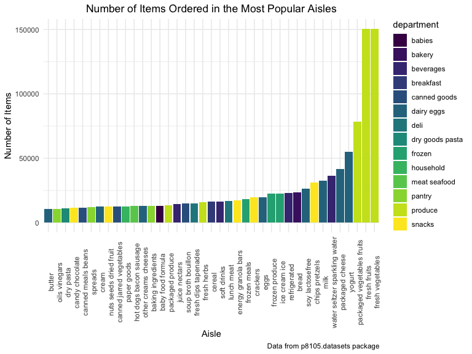
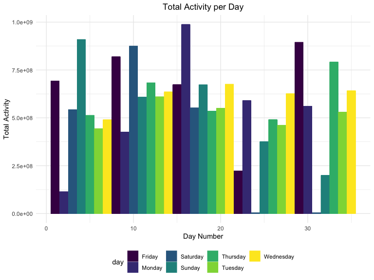

p8105\_hw3\_rs4025
================
Rebecca Silva
10/14/2019

# Questions:

  - delete/renumber tables
  - plot for prob 1?
  - add labels and titles to all plots\! and follow rubric
  - is “patchwork” pkg already in one of my packages
  - still need to comment on findings of prob
2

## Problem 1

# write a short description of the dataset, noting the size and structure of the data, describing some key variables, and giving illstrative examples of observations.

The `instacart` dataset gives infomation about online grocery shopping
in 2017 using the grocery service, Instacart. It has 1384617
observations where each observation represents a specific product from a
specific order number. There are 15 variables, 4 of which are character
variables, and 11 of which are integer variables. Some key variables and
ones that we focus on are as follows:

  - `order_id`: order number
  - `product_id`: product number
  - `user_id`: user number
  - `order_number`: sequence number of order for user
  - `order_dow`: day of the week on which order placed (0-7)
  - `order_hour_of_day`: hour of day in which order placed
  - `product_name` (character): name of product
  - `aisle_id`: aisle number
  - `aisle` (character): sorts/types of products aisle contains
  - `department` (character): name of department/ product categories

To give an example of the dataset, the first 3 observations are shown
below in Table 1.

``` r
head = head(instacart, 3) 
knitr::kable(head, 
             caption = "Table 1: First 3 Observations of Instacart dataset")
```

<table>

<caption>

Table 1: First 3 Observations of Instacart dataset

</caption>

<thead>

<tr>

<th style="text-align:right;">

order\_id

</th>

<th style="text-align:right;">

product\_id

</th>

<th style="text-align:right;">

add\_to\_cart\_order

</th>

<th style="text-align:right;">

reordered

</th>

<th style="text-align:right;">

user\_id

</th>

<th style="text-align:left;">

eval\_set

</th>

<th style="text-align:right;">

order\_number

</th>

<th style="text-align:right;">

order\_dow

</th>

<th style="text-align:right;">

order\_hour\_of\_day

</th>

<th style="text-align:right;">

days\_since\_prior\_order

</th>

<th style="text-align:left;">

product\_name

</th>

<th style="text-align:right;">

aisle\_id

</th>

<th style="text-align:right;">

department\_id

</th>

<th style="text-align:left;">

aisle

</th>

<th style="text-align:left;">

department

</th>

</tr>

</thead>

<tbody>

<tr>

<td style="text-align:right;">

1

</td>

<td style="text-align:right;">

49302

</td>

<td style="text-align:right;">

1

</td>

<td style="text-align:right;">

1

</td>

<td style="text-align:right;">

112108

</td>

<td style="text-align:left;">

train

</td>

<td style="text-align:right;">

4

</td>

<td style="text-align:right;">

4

</td>

<td style="text-align:right;">

10

</td>

<td style="text-align:right;">

9

</td>

<td style="text-align:left;">

Bulgarian Yogurt

</td>

<td style="text-align:right;">

120

</td>

<td style="text-align:right;">

16

</td>

<td style="text-align:left;">

yogurt

</td>

<td style="text-align:left;">

dairy eggs

</td>

</tr>

<tr>

<td style="text-align:right;">

1

</td>

<td style="text-align:right;">

11109

</td>

<td style="text-align:right;">

2

</td>

<td style="text-align:right;">

1

</td>

<td style="text-align:right;">

112108

</td>

<td style="text-align:left;">

train

</td>

<td style="text-align:right;">

4

</td>

<td style="text-align:right;">

4

</td>

<td style="text-align:right;">

10

</td>

<td style="text-align:right;">

9

</td>

<td style="text-align:left;">

Organic 4% Milk Fat Whole Milk Cottage Cheese

</td>

<td style="text-align:right;">

108

</td>

<td style="text-align:right;">

16

</td>

<td style="text-align:left;">

other creams cheeses

</td>

<td style="text-align:left;">

dairy eggs

</td>

</tr>

<tr>

<td style="text-align:right;">

1

</td>

<td style="text-align:right;">

10246

</td>

<td style="text-align:right;">

3

</td>

<td style="text-align:right;">

0

</td>

<td style="text-align:right;">

112108

</td>

<td style="text-align:left;">

train

</td>

<td style="text-align:right;">

4

</td>

<td style="text-align:right;">

4

</td>

<td style="text-align:right;">

10

</td>

<td style="text-align:right;">

9

</td>

<td style="text-align:left;">

Organic Celery Hearts

</td>

<td style="text-align:right;">

83

</td>

<td style="text-align:right;">

4

</td>

<td style="text-align:left;">

fresh vegetables

</td>

<td style="text-align:left;">

produce

</td>

</tr>

</tbody>

</table>

For a more illustrative example, let Bob be a costumer on Instacart.
Bob’s order of the `product` Bulgarian yogurt from the `aisle` yogurt
and `department` dairy eggs, ordered on the 4th day of the week at hour
10 (12pm), represents one observation in the sata set. Other variables
not listed in this example are included in the dataset, although we do
not focus on them in our exploration.

``` r
aisle = 
  instacart %>% 
  group_by(aisle) %>%   
  summarize(n = n()) %>% 
  arrange(desc(n))
```

There are 134 aisles in the online grocery store, the most popular of
which are fresh vegetables (150609 total orders), fresh fruits (150473
total orders), and packaged vegetables and fruit (78493 total orders).

``` r
# plot number of orders by aisles
instacart %>% 
  group_by(department, aisle) %>% 
  summarize(n = n()) %>% 
  ungroup() %>% 
  mutate(aisle = forcats::fct_reorder(aisle, n)) %>% 
  filter( n > 10000) %>% 
  ggplot(aes(x = aisle, y = n, fill = department)) + 
  geom_bar(stat = "identity") + 
  labs(
    title = "Number of Items Ordered in the Most Popular Aisles",
    x = "Aisle",
    y = "Number of Items", 
    caption = "Data from p8105.datasets package") +
  theme(legend.position = "right", 
        axis.text.x = element_text(angle = 90),
        plot.title = element_text(hjust = 0.5))
```



``` r
table_aisle = 
  instacart %>% 
  filter(aisle %in% c("baking ingredients",
                      "dog food care", 
                      "packaged vegetables fruits")) %>% 
  group_by(aisle, product_name) %>% 
  summarise(n = n()) %>% 
  mutate(rank = min_rank(desc(n))) %>% 
  filter(rank < 4) %>% 
  arrange(desc(n)) %>% 
  select(-rank)
        
knitr::kable(table_aisle, 
            caption = "Most popular items from Baking Ingredients,
            Dog Food Care, <br>
            and Packaged Vegetables and Fruit")
```

<table>

<caption>

Most popular items from Baking Ingredients, Dog Food Care, <br> and
Packaged Vegetables and Fruit

</caption>

<thead>

<tr>

<th style="text-align:left;">

aisle

</th>

<th style="text-align:left;">

product\_name

</th>

<th style="text-align:right;">

n

</th>

</tr>

</thead>

<tbody>

<tr>

<td style="text-align:left;">

packaged vegetables fruits

</td>

<td style="text-align:left;">

Organic Baby Spinach

</td>

<td style="text-align:right;">

9784

</td>

</tr>

<tr>

<td style="text-align:left;">

packaged vegetables fruits

</td>

<td style="text-align:left;">

Organic Raspberries

</td>

<td style="text-align:right;">

5546

</td>

</tr>

<tr>

<td style="text-align:left;">

packaged vegetables fruits

</td>

<td style="text-align:left;">

Organic Blueberries

</td>

<td style="text-align:right;">

4966

</td>

</tr>

<tr>

<td style="text-align:left;">

baking ingredients

</td>

<td style="text-align:left;">

Light Brown Sugar

</td>

<td style="text-align:right;">

499

</td>

</tr>

<tr>

<td style="text-align:left;">

baking ingredients

</td>

<td style="text-align:left;">

Pure Baking Soda

</td>

<td style="text-align:right;">

387

</td>

</tr>

<tr>

<td style="text-align:left;">

baking ingredients

</td>

<td style="text-align:left;">

Cane Sugar

</td>

<td style="text-align:right;">

336

</td>

</tr>

<tr>

<td style="text-align:left;">

dog food care

</td>

<td style="text-align:left;">

Snack Sticks Chicken & Rice Recipe Dog Treats

</td>

<td style="text-align:right;">

30

</td>

</tr>

<tr>

<td style="text-align:left;">

dog food care

</td>

<td style="text-align:left;">

Organix Chicken & Brown Rice Recipe

</td>

<td style="text-align:right;">

28

</td>

</tr>

<tr>

<td style="text-align:left;">

dog food care

</td>

<td style="text-align:left;">

Small Dog
Biscuits

</td>

<td style="text-align:right;">

26

</td>

</tr>

</tbody>

</table>

# Make a table showing the mean hour of the day at which Pink Lady Apples and Coffee Ice Cream are ordered on each day of the week; format this table for human readers (i.e. produce a 2 x 7 table)

note: I rounded mean hour to closest hour \#Q: still dont know if I
should leave order\_dow as is or covert to day of week w mutate (code is
b) - can make an assumption

``` r
mean_table = 
  instacart %>% 
  filter( product_name %in% c("Pink Lady Apples", "Coffee Ice Cream")) %>% 
  select( product_name, order_dow, order_hour_of_day) %>% 
  group_by( product_name, order_dow) %>% 
  summarize(mean = round(mean(order_hour_of_day))) %>% 
  pivot_wider(
    names_from = order_dow, 
    values_from = mean)

#mutate(order_dow = recode(as.character(order_dow), `1` = "Monday", `2` = "Tuesday")) %>%

knitr::kable(mean_table, 
            caption = "Mean Hour of Day for Orders of Pink Lady Apples <br> and Coffee Ice Cream")
```

<table>

<caption>

Mean Hour of Day for Orders of Pink Lady Apples <br> and Coffee Ice
Cream

</caption>

<thead>

<tr>

<th style="text-align:left;">

product\_name

</th>

<th style="text-align:right;">

0

</th>

<th style="text-align:right;">

1

</th>

<th style="text-align:right;">

2

</th>

<th style="text-align:right;">

3

</th>

<th style="text-align:right;">

4

</th>

<th style="text-align:right;">

5

</th>

<th style="text-align:right;">

6

</th>

</tr>

</thead>

<tbody>

<tr>

<td style="text-align:left;">

Coffee Ice Cream

</td>

<td style="text-align:right;">

14

</td>

<td style="text-align:right;">

14

</td>

<td style="text-align:right;">

15

</td>

<td style="text-align:right;">

15

</td>

<td style="text-align:right;">

15

</td>

<td style="text-align:right;">

12

</td>

<td style="text-align:right;">

14

</td>

</tr>

<tr>

<td style="text-align:left;">

Pink Lady Apples

</td>

<td style="text-align:right;">

13

</td>

<td style="text-align:right;">

11

</td>

<td style="text-align:right;">

12

</td>

<td style="text-align:right;">

14

</td>

<td style="text-align:right;">

12

</td>

<td style="text-align:right;">

13

</td>

<td style="text-align:right;">

12

</td>

</tr>

</tbody>

</table>

## Problem 2

``` r
# data cleaning
brfss = 
  janitor::clean_names(brfss_smart2010) %>% 
  separate(locationdesc, 
           into = c("state", "county"), 
           sep = " - ") %>% 
  select(- locationabbr) %>% 
  filter( topic == "Overall Health",
          response %in% c("Poor", "Fair","Good", "Very good", "Excellent")) %>% 
   mutate(response = forcats::fct_relevel(response, c("Poor", "Fair","Good", "Very good", "Excellent")))
```

``` r
# states at 7 or more locations

# 2002
brfss_2002 = 
  brfss %>% 
  filter( year == 2002) %>% 
  group_by(state) %>% 
  summarize( n_locations = n()) %>% 
  filter( n_locations >= 7)

# 2010
brfss_2010 = 
  brfss %>% 
  filter( year == 2010) %>% 
  group_by(state) %>% 
  summarize( n_locations = n()) %>% 
  filter( n_locations >= 7)
```

In 2002, the states AZ, CO, CT, DE, FL, GA, HI, ID, IL, IN, KS, LA, MA,
MD, ME, MI, MN, MO, NC, NE, NH, NJ, NV, NY, OH, OK, OR, PA, RI, SC, SD,
TN, TX, UT, VT, WA were observed at 7 or more location and in 2010, 45
states were observed at 7 or more locations, specifically, AL, AR, AZ,
CA, CO, CT, DE, FL, GA, HI, IA, ID, IL, IN, KS, LA, MA, MD, ME, MI, MN,
MO, MS, MT, NC, ND, NE, NH, NJ, NM, NV, NY, OH, OK, OR, PA, RI, SC, SD,
TN, TX, UT, VT, WA, WY.

``` r
# data set for excellent responses
brfss_excellent = 
  brfss %>% 
  filter( response == "Excellent") %>% 
  group_by(year, state) %>% 
  summarize(avg_data_value = mean(data_value,  na.rm = TRUE)) 

# spaghetti plot
brfss_excellent %>% 
  ggplot(aes( x = year, y = avg_data_value, color = state)) + 
  geom_line(aes(group = state)) + 
  theme(legend.position = "right") +
  labs(
    title = "Mean data value for each state from 2002 to 2010",
    x = "Year",
    y = "Mean Data Value") +
  theme(plot.title = element_text(hjust = 0.5))
```


The “spaghetti” plot of average value over time within a state shows how
varied the mean data value each year can be for the majority of states.
Although adding color is not helpful in identifying which states belongs
to each line, it helps show how the lines are frequently crossing each
other, further depicting the up and down nature of average values for
each state.

``` r
# facet by year, boxplot plot
brfss %>% 
  filter( year %in% c(2006, 2010), state == "NY") %>% 
  ggplot(aes(x = response, y = data_value, color = response)) +
  geom_boxplot(aes(fill = response), alpha = .4) +
  facet_grid(~year) +
  labs(
      title = "Boxplot of Data Value by Response",
      x = "Response",
      y = "Data Value", 
      caption = "Data from p8105.datasets package") + 
  theme(plot.title = element_text(hjust = 0.5)) 
```


By looking at the distribution of responses from 2006 and 2010 next to
one another, we can see that for each response type, data values share
similar ranges of values but have differently shaped distributions and
peak around the different values within a similar ranges. For example,
for the “excellent” response type, in 2006 the distribution of data
values is right skewed while in 2010 it is left skewed, and the median
value for excellent is higher in 2010 than 2006. It is interesting to
see that “poor” responses show the least variability in data values and
“good” and “very good” responses seem to vary the most.

## Problem 3

``` r
# tidy data
accel = 
  read_csv("./data/accel_data.csv") %>% 
  janitor::clean_names() %>% 
  pivot_longer(
    activity_1:activity_1440,
    names_to = "minute_num", 
    values_to = "activity_count", 
    names_prefix = "activity_") %>% 
  mutate( minute_num = as.numeric(minute_num), 
          day_type = replace( day , 
                             day %in% c("Saturday", "Sunday"),
                             "weekend"), 
         day_type = replace( day_type , 
                             day %in% c("Monday", "Tuesday", "Wednesday", "Thursday", "Friday"),
                             "weekday")) %>% 
  select( week, day_id, day, day_type, everything())
```

The data set `accel` reports accelerometer data of a 63 year-old man for
5 weeks. There are 50400 observations, each representing a minute in the
5 weeks, and 6 variables. Variable descriptions are as follows:

  - `week`: numeric, representing week number (1-5)
  - `day_id`: numeric, number of day (1-35)
  - `day`: character, weekday
  - `day_type`: character, values: weekend or weekday
  - `minute_num`: numeric, minute number (1-1440)
  - `activity_count`: numeric, data reported on activity

<!-- end list -->

``` r
# by day activity
table_total_activity = 
  accel %>% 
  group_by(day_id) %>% 
  summarize( total_activity = sum(activity_count)) 

knitr::kable(table_total_activity, 
             caption = "Total Activity per Day")
```

<table>

<caption>

Total Activity per Day

</caption>

<thead>

<tr>

<th style="text-align:right;">

day\_id

</th>

<th style="text-align:right;">

total\_activity

</th>

</tr>

</thead>

<tbody>

<tr>

<td style="text-align:right;">

1

</td>

<td style="text-align:right;">

480542.62

</td>

</tr>

<tr>

<td style="text-align:right;">

2

</td>

<td style="text-align:right;">

78828.07

</td>

</tr>

<tr>

<td style="text-align:right;">

3

</td>

<td style="text-align:right;">

376254.00

</td>

</tr>

<tr>

<td style="text-align:right;">

4

</td>

<td style="text-align:right;">

631105.00

</td>

</tr>

<tr>

<td style="text-align:right;">

5

</td>

<td style="text-align:right;">

355923.64

</td>

</tr>

<tr>

<td style="text-align:right;">

6

</td>

<td style="text-align:right;">

307094.24

</td>

</tr>

<tr>

<td style="text-align:right;">

7

</td>

<td style="text-align:right;">

340115.01

</td>

</tr>

<tr>

<td style="text-align:right;">

8

</td>

<td style="text-align:right;">

568839.00

</td>

</tr>

<tr>

<td style="text-align:right;">

9

</td>

<td style="text-align:right;">

295431.00

</td>

</tr>

<tr>

<td style="text-align:right;">

10

</td>

<td style="text-align:right;">

607175.00

</td>

</tr>

<tr>

<td style="text-align:right;">

11

</td>

<td style="text-align:right;">

422018.00

</td>

</tr>

<tr>

<td style="text-align:right;">

12

</td>

<td style="text-align:right;">

474048.00

</td>

</tr>

<tr>

<td style="text-align:right;">

13

</td>

<td style="text-align:right;">

423245.00

</td>

</tr>

<tr>

<td style="text-align:right;">

14

</td>

<td style="text-align:right;">

440962.00

</td>

</tr>

<tr>

<td style="text-align:right;">

15

</td>

<td style="text-align:right;">

467420.00

</td>

</tr>

<tr>

<td style="text-align:right;">

16

</td>

<td style="text-align:right;">

685910.00

</td>

</tr>

<tr>

<td style="text-align:right;">

17

</td>

<td style="text-align:right;">

382928.00

</td>

</tr>

<tr>

<td style="text-align:right;">

18

</td>

<td style="text-align:right;">

467052.00

</td>

</tr>

<tr>

<td style="text-align:right;">

19

</td>

<td style="text-align:right;">

371230.00

</td>

</tr>

<tr>

<td style="text-align:right;">

20

</td>

<td style="text-align:right;">

381507.00

</td>

</tr>

<tr>

<td style="text-align:right;">

21

</td>

<td style="text-align:right;">

468869.00

</td>

</tr>

<tr>

<td style="text-align:right;">

22

</td>

<td style="text-align:right;">

154049.00

</td>

</tr>

<tr>

<td style="text-align:right;">

23

</td>

<td style="text-align:right;">

409450.00

</td>

</tr>

<tr>

<td style="text-align:right;">

24

</td>

<td style="text-align:right;">

1440.00

</td>

</tr>

<tr>

<td style="text-align:right;">

25

</td>

<td style="text-align:right;">

260617.00

</td>

</tr>

<tr>

<td style="text-align:right;">

26

</td>

<td style="text-align:right;">

340291.00

</td>

</tr>

<tr>

<td style="text-align:right;">

27

</td>

<td style="text-align:right;">

319568.00

</td>

</tr>

<tr>

<td style="text-align:right;">

28

</td>

<td style="text-align:right;">

434460.00

</td>

</tr>

<tr>

<td style="text-align:right;">

29

</td>

<td style="text-align:right;">

620860.00

</td>

</tr>

<tr>

<td style="text-align:right;">

30

</td>

<td style="text-align:right;">

389080.00

</td>

</tr>

<tr>

<td style="text-align:right;">

31

</td>

<td style="text-align:right;">

1440.00

</td>

</tr>

<tr>

<td style="text-align:right;">

32

</td>

<td style="text-align:right;">

138421.00

</td>

</tr>

<tr>

<td style="text-align:right;">

33

</td>

<td style="text-align:right;">

549658.00

</td>

</tr>

<tr>

<td style="text-align:right;">

34

</td>

<td style="text-align:right;">

367824.00

</td>

</tr>

<tr>

<td style="text-align:right;">

35

</td>

<td style="text-align:right;">

445366.00

</td>

</tr>

</tbody>

</table>

``` r
# look for trends
accel %>% 
  group_by(day_id) %>% 
  mutate( total_activity = sum(activity_count)) %>% 
  ggplot(aes(x = day_id, y = total_activity, color = day)) +
  geom_bar(stat = "identity", aes(fill = day)) +
  labs(
      title = "Total Activity per Day",
      x = "Day Number",
      y = "Total Activity") + 
  theme(plot.title = element_text(hjust = 0.5)) 
```


It is most easy to identify trends in total activity graphically,
although the table is helpful in identifying exact total activity for
each day. We can see from the table and bar plot that they are no
apparent trends based on day of week but we do see that total activity
seems to fluctuate the must after day 20 until the end of the data
collection period.

``` r
# by day activity plot 
accel %>% 
  ggplot(aes(x = minute_num, y = activity_count, color = day)) +
  geom_point() +
  geom_line(aes(group = day_id)) +
  labs(
      title = "24-Hour Activity Map",
      x = "Time",
      y = "Activity Count") + 
  theme(plot.title = element_text(hjust = 0.5)) +
   scale_x_continuous(
    breaks = c(0, 120, 240, 360, 480, 600, 720, 840, 960, 1080, 1200, 1320, 1440), 
    labels = c("12am", "2", "4", "6", "8", "10", "12pm", "2", "4", "6", "8", "10", "11"))
```



Although it is difficult to see individual day trends, the 24-hour
activity map above shows us where the majority of activity counts lie
and how often they peak throughout a day. It is interesting to note that
in about the first 6 or 7 hours there is little activity because the
subject must be sleeping. Then, the first large peaks in the morning
would acount for anything he does in the morning that is active. Around
lunch time (12pm), the activity is a little higher, especially on
Sundays and on sundays, it seems he is most active in the afternoon,
around 4pm. Typically, he seems most active near the end of the day
around 8-9 pm, especially on Fridays.
