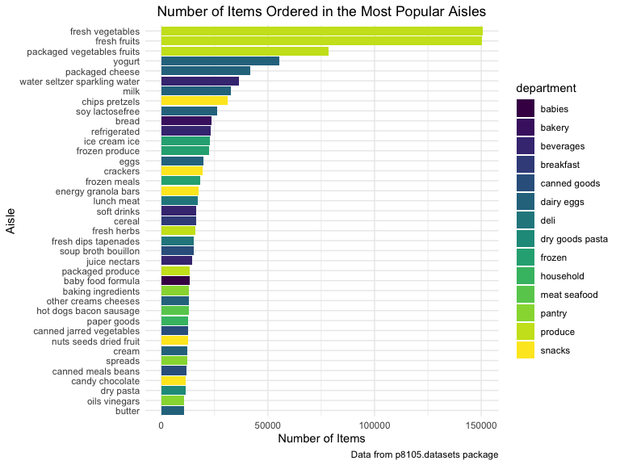

p8105\_hw3\_rs4025
================
Rebecca Silva
10/4/2019

## Problem 1

write a short description of the dataset, noting the size and structure
of the data, describing some key variables, and giving illstrative
examples of observations.

The `instacart` dataset gives infomation about online grocery shopping
in 2017 using the grocery service, Instacart. It has 1384617
observations of 15 variables, 4 of which are character variables, and 11
of which are integer variables. Some key variables (that we will work
on) are as follows: \* `order_id`: order number \* `product_id`: product
number \* `user_id`: user number \* `order_number`: sequence number of
order for user \* `product_name` (character): name/type of product \*
`aisle_id`: aisle\_id \* `aisle` (character): sorts of products aisle
contains \* `department` (character): name of department

(could list first the ones that are self explanatory?)

## note order of key vars

## give illstrative examples of observations ?

To give an example of the dataset, the first 10 observations are shown
below in Table 1.

``` r
head = head(instacart, 10) 

knitr::kable(head, 
             caption = "Table 1: First 10 Observation of Instacart dataset")
```

<table>

<caption>

Table 1: First 10 Observation of Instacart dataset

</caption>

<thead>

<tr>

<th style="text-align:right;">

order\_id

</th>

<th style="text-align:right;">

product\_id

</th>

<th style="text-align:right;">

add\_to\_cart\_order

</th>

<th style="text-align:right;">

reordered

</th>

<th style="text-align:right;">

user\_id

</th>

<th style="text-align:left;">

eval\_set

</th>

<th style="text-align:right;">

order\_number

</th>

<th style="text-align:right;">

order\_dow

</th>

<th style="text-align:right;">

order\_hour\_of\_day

</th>

<th style="text-align:right;">

days\_since\_prior\_order

</th>

<th style="text-align:left;">

product\_name

</th>

<th style="text-align:right;">

aisle\_id

</th>

<th style="text-align:right;">

department\_id

</th>

<th style="text-align:left;">

aisle

</th>

<th style="text-align:left;">

department

</th>

</tr>

</thead>

<tbody>

<tr>

<td style="text-align:right;">

1

</td>

<td style="text-align:right;">

49302

</td>

<td style="text-align:right;">

1

</td>

<td style="text-align:right;">

1

</td>

<td style="text-align:right;">

112108

</td>

<td style="text-align:left;">

train

</td>

<td style="text-align:right;">

4

</td>

<td style="text-align:right;">

4

</td>

<td style="text-align:right;">

10

</td>

<td style="text-align:right;">

9

</td>

<td style="text-align:left;">

Bulgarian Yogurt

</td>

<td style="text-align:right;">

120

</td>

<td style="text-align:right;">

16

</td>

<td style="text-align:left;">

yogurt

</td>

<td style="text-align:left;">

dairy eggs

</td>

</tr>

<tr>

<td style="text-align:right;">

1

</td>

<td style="text-align:right;">

11109

</td>

<td style="text-align:right;">

2

</td>

<td style="text-align:right;">

1

</td>

<td style="text-align:right;">

112108

</td>

<td style="text-align:left;">

train

</td>

<td style="text-align:right;">

4

</td>

<td style="text-align:right;">

4

</td>

<td style="text-align:right;">

10

</td>

<td style="text-align:right;">

9

</td>

<td style="text-align:left;">

Organic 4% Milk Fat Whole Milk Cottage Cheese

</td>

<td style="text-align:right;">

108

</td>

<td style="text-align:right;">

16

</td>

<td style="text-align:left;">

other creams cheeses

</td>

<td style="text-align:left;">

dairy eggs

</td>

</tr>

<tr>

<td style="text-align:right;">

1

</td>

<td style="text-align:right;">

10246

</td>

<td style="text-align:right;">

3

</td>

<td style="text-align:right;">

0

</td>

<td style="text-align:right;">

112108

</td>

<td style="text-align:left;">

train

</td>

<td style="text-align:right;">

4

</td>

<td style="text-align:right;">

4

</td>

<td style="text-align:right;">

10

</td>

<td style="text-align:right;">

9

</td>

<td style="text-align:left;">

Organic Celery Hearts

</td>

<td style="text-align:right;">

83

</td>

<td style="text-align:right;">

4

</td>

<td style="text-align:left;">

fresh vegetables

</td>

<td style="text-align:left;">

produce

</td>

</tr>

<tr>

<td style="text-align:right;">

1

</td>

<td style="text-align:right;">

49683

</td>

<td style="text-align:right;">

4

</td>

<td style="text-align:right;">

0

</td>

<td style="text-align:right;">

112108

</td>

<td style="text-align:left;">

train

</td>

<td style="text-align:right;">

4

</td>

<td style="text-align:right;">

4

</td>

<td style="text-align:right;">

10

</td>

<td style="text-align:right;">

9

</td>

<td style="text-align:left;">

Cucumber Kirby

</td>

<td style="text-align:right;">

83

</td>

<td style="text-align:right;">

4

</td>

<td style="text-align:left;">

fresh vegetables

</td>

<td style="text-align:left;">

produce

</td>

</tr>

<tr>

<td style="text-align:right;">

1

</td>

<td style="text-align:right;">

43633

</td>

<td style="text-align:right;">

5

</td>

<td style="text-align:right;">

1

</td>

<td style="text-align:right;">

112108

</td>

<td style="text-align:left;">

train

</td>

<td style="text-align:right;">

4

</td>

<td style="text-align:right;">

4

</td>

<td style="text-align:right;">

10

</td>

<td style="text-align:right;">

9

</td>

<td style="text-align:left;">

Lightly Smoked Sardines in Olive Oil

</td>

<td style="text-align:right;">

95

</td>

<td style="text-align:right;">

15

</td>

<td style="text-align:left;">

canned meat seafood

</td>

<td style="text-align:left;">

canned goods

</td>

</tr>

<tr>

<td style="text-align:right;">

1

</td>

<td style="text-align:right;">

13176

</td>

<td style="text-align:right;">

6

</td>

<td style="text-align:right;">

0

</td>

<td style="text-align:right;">

112108

</td>

<td style="text-align:left;">

train

</td>

<td style="text-align:right;">

4

</td>

<td style="text-align:right;">

4

</td>

<td style="text-align:right;">

10

</td>

<td style="text-align:right;">

9

</td>

<td style="text-align:left;">

Bag of Organic Bananas

</td>

<td style="text-align:right;">

24

</td>

<td style="text-align:right;">

4

</td>

<td style="text-align:left;">

fresh fruits

</td>

<td style="text-align:left;">

produce

</td>

</tr>

<tr>

<td style="text-align:right;">

1

</td>

<td style="text-align:right;">

47209

</td>

<td style="text-align:right;">

7

</td>

<td style="text-align:right;">

0

</td>

<td style="text-align:right;">

112108

</td>

<td style="text-align:left;">

train

</td>

<td style="text-align:right;">

4

</td>

<td style="text-align:right;">

4

</td>

<td style="text-align:right;">

10

</td>

<td style="text-align:right;">

9

</td>

<td style="text-align:left;">

Organic Hass Avocado

</td>

<td style="text-align:right;">

24

</td>

<td style="text-align:right;">

4

</td>

<td style="text-align:left;">

fresh fruits

</td>

<td style="text-align:left;">

produce

</td>

</tr>

<tr>

<td style="text-align:right;">

1

</td>

<td style="text-align:right;">

22035

</td>

<td style="text-align:right;">

8

</td>

<td style="text-align:right;">

1

</td>

<td style="text-align:right;">

112108

</td>

<td style="text-align:left;">

train

</td>

<td style="text-align:right;">

4

</td>

<td style="text-align:right;">

4

</td>

<td style="text-align:right;">

10

</td>

<td style="text-align:right;">

9

</td>

<td style="text-align:left;">

Organic Whole String Cheese

</td>

<td style="text-align:right;">

21

</td>

<td style="text-align:right;">

16

</td>

<td style="text-align:left;">

packaged cheese

</td>

<td style="text-align:left;">

dairy eggs

</td>

</tr>

<tr>

<td style="text-align:right;">

36

</td>

<td style="text-align:right;">

39612

</td>

<td style="text-align:right;">

1

</td>

<td style="text-align:right;">

0

</td>

<td style="text-align:right;">

79431

</td>

<td style="text-align:left;">

train

</td>

<td style="text-align:right;">

23

</td>

<td style="text-align:right;">

6

</td>

<td style="text-align:right;">

18

</td>

<td style="text-align:right;">

30

</td>

<td style="text-align:left;">

Grated Pecorino Romano Cheese

</td>

<td style="text-align:right;">

2

</td>

<td style="text-align:right;">

16

</td>

<td style="text-align:left;">

specialty cheeses

</td>

<td style="text-align:left;">

dairy eggs

</td>

</tr>

<tr>

<td style="text-align:right;">

36

</td>

<td style="text-align:right;">

19660

</td>

<td style="text-align:right;">

2

</td>

<td style="text-align:right;">

1

</td>

<td style="text-align:right;">

79431

</td>

<td style="text-align:left;">

train

</td>

<td style="text-align:right;">

23

</td>

<td style="text-align:right;">

6

</td>

<td style="text-align:right;">

18

</td>

<td style="text-align:right;">

30

</td>

<td style="text-align:left;">

Spring Water

</td>

<td style="text-align:right;">

115

</td>

<td style="text-align:right;">

7

</td>

<td style="text-align:left;">

water seltzer sparkling water

</td>

<td style="text-align:left;">

beverages

</td>

</tr>

</tbody>

</table>

How many aisles are there, and which aisles are the most items ordered
from?

``` r
aisle = 
  instacart %>% 
  group_by(aisle, aisle_id) %>%   ## dont think i need aisle_id
  summarize(n = n()) %>% 
  arrange(desc(n))
```

There are 134 aisles in the online grocery store, the most popular of
which are fresh vegetables and fresh fruits.

# remove table

``` r
knitr::kable(head(aisle,3), 
             caption = "Table 2: Top 3 Most Popular Aisles")
```

<table>

<caption>

Table 2: Top 3 Most Popular Aisles

</caption>

<thead>

<tr>

<th style="text-align:left;">

aisle

</th>

<th style="text-align:right;">

aisle\_id

</th>

<th style="text-align:right;">

n

</th>

</tr>

</thead>

<tbody>

<tr>

<td style="text-align:left;">

fresh vegetables

</td>

<td style="text-align:right;">

83

</td>

<td style="text-align:right;">

150609

</td>

</tr>

<tr>

<td style="text-align:left;">

fresh fruits

</td>

<td style="text-align:right;">

24

</td>

<td style="text-align:right;">

150473

</td>

</tr>

<tr>

<td style="text-align:left;">

packaged vegetables fruits

</td>

<td style="text-align:right;">

123

</td>

<td style="text-align:right;">

78493

</td>

</tr>

</tbody>

</table>

confused about what each separate observation is

Make a plot that shows the number of items ordered in each aisle,
limiting this to aisles with more than 10000 items ordered. Arrange
aisles sensibly, and organize your plot so others can read it. \#\# do
not know what he wants (cld order by department? no)

``` r
aisle %>% 
  filter( n > 10000) %>% 
  ggplot(aes(x = aisle_id, fill = aisle)) + 
  geom_histogram() + 
  labs(
    title = "Number of Items by Aisle",
    x = "Aisle Number",
    y = "Number of Items")
```

    ## `stat_bin()` using `bins = 30`. Pick better value with `binwidth`.



``` r
aisle %>% 
  filter( n > 10000) %>% 
  mutate(n_rank = min_rank(desc(n))) %>% 
  ggplot(aes(x = aisle, y = n)) + 
  geom_point() + 
  labs(
    title = "Number of Items by Aisle",
    x = "Aisle Number",
    y = "Number of Items")
```


``` r
## the correct one?
aisle %>% 
  ungroup() %>% 
  mutate(aisle = forcats::fct_reorder(aisle, n)) %>% 
  filter( n > 10000) %>% 
  ggplot(aes(x = aisle, y = n)) + 
  geom_point() + 
  labs(
    title = "Number of Items by Aisle",
    x = "Aisle",
    y = "Number of Items") +
  theme(axis.text.x = element_text(angle = 90))
```


``` r
## try faceting by department -- not pretty
instacart %>% 
  group_by(department, aisle) %>% 
  summarize(n = n()) %>% 
  ungroup() %>% 
  mutate(aisle = forcats::fct_reorder(aisle, n)) %>% 
  filter( n > 10000) %>% 
  ggplot(aes(x = aisle, y = n)) + 
  geom_point() + 
  facet_grid(. ~ department)
```


``` r
  labs(
    title = "Number of Items by Aisle",
    x = "Aisle",
    y = "Number of Items") +
  theme(axis.text.x = element_text(angle = 90))
```

    ## NULL

Make a table showing the three most popular items in each of the aisles
“baking ingredients”, “dog food care”, and “packaged vegetables
fruits”. Include the number of times each item is ordered in your
table.

``` r
table_aisle = 
  instacart %>% 
  filter(aisle %in% c("baking ingredients",
                      "dog food care", 
                      "packaged vegetables fruits")) %>% 
  group_by(aisle, product_name) %>% 
  summarise(n = n()) %>% 
  mutate(rank = min_rank(desc(n))) %>% 
  filter(rank < 4) %>% 
  arrange(desc(n)) %>% 
  select(-rank)
        
knitr::kable(table_aisle, 
            caption = "Table 1: Most popular items from Baking Ingredients, Dog Food Care, and Packaged Vegetables and Fruit")
```

<table>

<caption>

Table 1: Most popular items from Baking Ingredients, Dog Food Care, and
Packaged Vegetables and Fruit

</caption>

<thead>

<tr>

<th style="text-align:left;">

aisle

</th>

<th style="text-align:left;">

product\_name

</th>

<th style="text-align:right;">

n

</th>

</tr>

</thead>

<tbody>

<tr>

<td style="text-align:left;">

packaged vegetables fruits

</td>

<td style="text-align:left;">

Organic Baby Spinach

</td>

<td style="text-align:right;">

9784

</td>

</tr>

<tr>

<td style="text-align:left;">

packaged vegetables fruits

</td>

<td style="text-align:left;">

Organic Raspberries

</td>

<td style="text-align:right;">

5546

</td>

</tr>

<tr>

<td style="text-align:left;">

packaged vegetables fruits

</td>

<td style="text-align:left;">

Organic Blueberries

</td>

<td style="text-align:right;">

4966

</td>

</tr>

<tr>

<td style="text-align:left;">

baking ingredients

</td>

<td style="text-align:left;">

Light Brown Sugar

</td>

<td style="text-align:right;">

499

</td>

</tr>

<tr>

<td style="text-align:left;">

baking ingredients

</td>

<td style="text-align:left;">

Pure Baking Soda

</td>

<td style="text-align:right;">

387

</td>

</tr>

<tr>

<td style="text-align:left;">

baking ingredients

</td>

<td style="text-align:left;">

Cane Sugar

</td>

<td style="text-align:right;">

336

</td>

</tr>

<tr>

<td style="text-align:left;">

dog food care

</td>

<td style="text-align:left;">

Snack Sticks Chicken & Rice Recipe Dog Treats

</td>

<td style="text-align:right;">

30

</td>

</tr>

<tr>

<td style="text-align:left;">

dog food care

</td>

<td style="text-align:left;">

Organix Chicken & Brown Rice Recipe

</td>

<td style="text-align:right;">

28

</td>

</tr>

<tr>

<td style="text-align:left;">

dog food care

</td>

<td style="text-align:left;">

Small Dog Biscuits

</td>

<td style="text-align:right;">

26

</td>

</tr>

</tbody>

</table>
